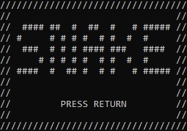
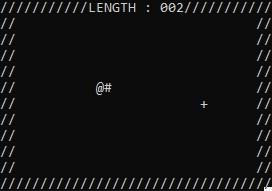

# C-Snake-Game

This project is my first C project. It's a reproduction of "Snake" using the Windows console outputs.
## Features
- The game
## Installation
1. Download the repository by clicking on `Code > Download ZIP`
2. Extract the ZIP file
3. Run `main.exe`
## Usage
After opening `main.exe` you will see a window that looks like this :

You can start a game by pressing `ENTER` key.

Then you can move the snake head using arrows keys.